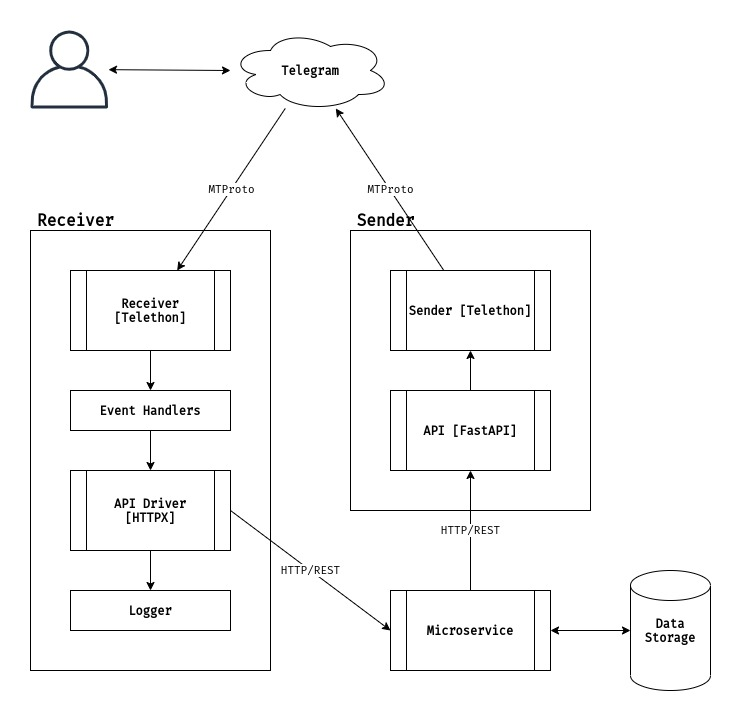

# Telegram Bot Microservice
Basis for extendable, high-performance Telegram Bot microservice. Implements:


## Tech Stack
- FastAPI
- Telethon
- AsyncIO
- Docker & docker-compose


## Features

### Receiver Service
- Updates Receiver [Telethon / MTProto] - receive updates on any action made by user directed to Telegram Bot/Account. Similar to Webhook Server or Long Polling, but faster and more stable due to use of MTProto protocol which is Telegram Native. [More on this topic](https://docs.telethon.dev/en/latest/concepts/botapi-vs-mtproto.html#advantages-of-mtproto-over-bot-api).
- Basic event handler - currently to stay as generic as possible service implements basic conversation. Functionality can be extended by adding new handlers.
- Async API Driver [HTTPX] - HTTP/REST API Driver to interact with other services.
- Logger for API Driver [Native Python Logger] - to monitor and log each request and response. Additionally, keeps logs in files to use with monitoring tools, such as ELK, Prometheus+Grafana, etc.

### Sender Service
- Async API [FastAPI] - receive requests from other services. Endpoints:
    * `/api_v1/send_message` - send plain message to user
    * `/api_v1/send_multiple_message` - send multiple messages to multiple users
    * `/api_v1/create_document` - create document on Telegram Servers and receive its ID, to later reuse
    * `/api_v1/send_document` - send document by Telegram ID
    * `/api_v1/send_multiple_documents` - send multiple documents to multiple users
- Sender [Telethon] - Telegram Client that will be triggered to execute some business logic after successful processing of request received by API, in other words to send updates to user.


## Whole Service Workflow
As it can be understood, this microservice is not "killer-beast" and is not suitable for all use-cases. It is mostly oriented for offload, high-speed interaction with users through Telegram.

Ideal workflow of service is following:
- user sends update to Telegram Bot/Account, which is received by specific event handler of **Receiver**
- event handler processes received data, adjusts it if needed and sends this data to **Other Microservice** through **API Driver**, note that you can implement as many API Drivers as you need to interact with your services.
- **Other Microservice** processes and executes its own business logic and sends result of processing to **API**.
- **API** receives the data from other service and transfers it Telegram through **Sender**, which is Telegram Client provided by Telethon.

Thus, we have fully autonomous, loosely-coupled microservice.

### Workflow Scheme




## How to Use

Root directory has docker-compose file through which whole microservice can be started. But firstly, build images:
```shell
docker-compose build
```
And start up services:
```shell
docker-compose up
```

**Sender** service API can be found on http://0.0.0.0:8001 and docs on http://0.0.0.0:8001/docs


## Enhancement, contribution, and feedback
Any feedback or contribution to the project is eagerly welcomed. Just create an issue or contact me on ki.xbozz@gmail.com.


## Recommended for reading:
- https://docs.telethon.dev/en/latest/quick-references/faq.html


## Todo:
- [ ] logging for FastAPI
- [ ] logging for Telethon event handlers
